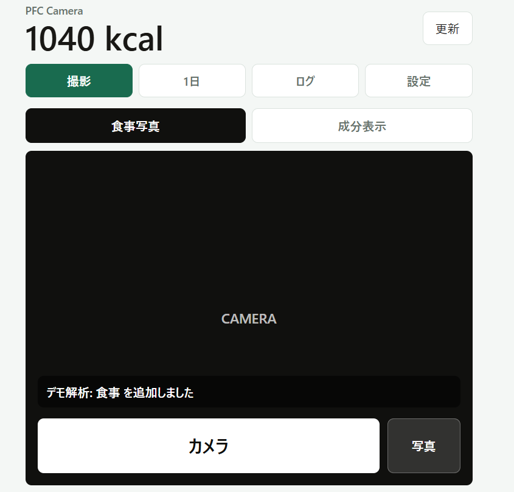
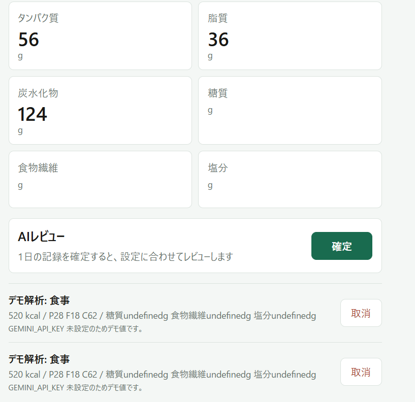
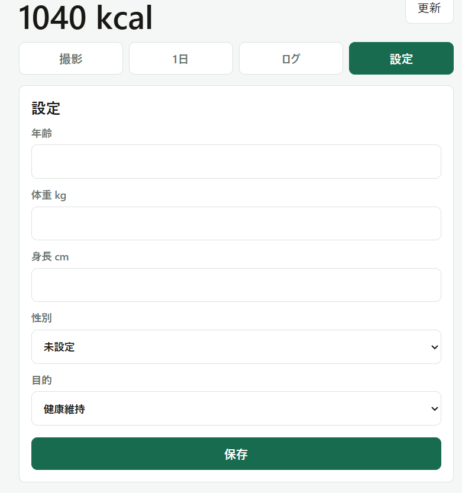

# Eatake

Eat + Take（撮影）から名付けた、 
「食事を撮るだけで記録できる」AI食事管理アプリです。

写真を撮るだけで、AIがカロリー・PFCバランス・糖質・食物繊維・塩分を推定し、自動で記録します。

---

## 概要

既存の食事記録アプリでは、栄養成分を毎回手入力する手間が大きく、継続が難しいと感じていました。

特に、自分自身が食事管理を行う中で、
食品検索、栄養成分入力や細かい記録作業の負担が大きく、「もっと簡単に続けられる方法が欲しい」と考えたことが、このアプリを作ったきっかけです。
そこで写真を撮るだけで食事記録を完了できるアプリをテーマに開発を行いました。
食事写真を Gemini API で解析し、栄養情報を推定してSQLiteへ保存します。  
また、栄養成分表示の写真を読み取るモードも実装し、パッケージ食品などでは表示値を優先して記録できるようにしています。

## アプリ画面

### 撮影画面

食事写真または栄養成分表示を撮影し、AIが栄養情報を推定します。

---

### 1日ログ画面

1日の合計カロリーやPFCバランスを自動集計します。  
AIレビュー機能も搭載しています。

---

### 設定画面

年齢・身長・体重・目的を保存し、AIレビューに反映します。

---

## 主な機能

### 食事撮影
- 食事写真からAIが栄養情報を推定
- カロリー / PFC / 糖質 / 食物繊維 / 塩分を自動算出

### 栄養成分表示読み取り
- パッケージ食品の栄養成分表示をOCRで読み取り
- 記載値を優先して保存

### 日別ログ管理
- 1日の栄養情報を自動集計
- 食べたもの一覧を表示
- カレンダーから過去ログ閲覧可能

### AIレビュー
登録したプロフィール情報をもとに、AIが食事内容をレビュー。

- 年齢
- 身長
- 体重
- 性別
- 目的（減量・維持など）
を考慮してコメントを生成します。

## 技術構成

### Backend
- Python
- FastAPI
- SQLite

### Frontend
- React
- HTML / CSS / JavaScript

### AI / API
- Gemini API

## AIコーディングについて

本アプリはAIコーディングを活用して開発しました。

FastAPIやReactなど未経験技術も含まれていたため、

- 必要機能の整理
- API設計
- UI設計
- 動作確認
- エラー修正
- ユーザー目線での改善
を繰り返しながら開発を進めています。
単にコード生成を行うだけではなく、
- 「どのような機能が必要か」
- 「ユーザーがどこで面倒に感じるか」
- 「どのようなUIなら継続しやすいか」
を考えながら改善を続けています。現在も自分で利用しながら継続的に改良しています。

http://127.0.0.1:8000
---

## 今後の改善予定

- 栄養推定精度向上
- グラフ表示
- クラウド保存
- ユーザー認証
- PWA対応
- 食事提案機能
- モバイルUI改善
- デプロイ完遂

---

## 作成背景

食事管理は「続けること」が最も難しいと感じています。
そのため、「入力の手間を減らし、できるだけ自然に継続できること」を重視して設計しました。
今後も、自分自身で使いながら改善を続けていく予定です。
