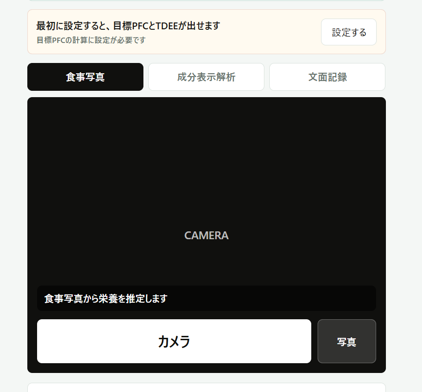
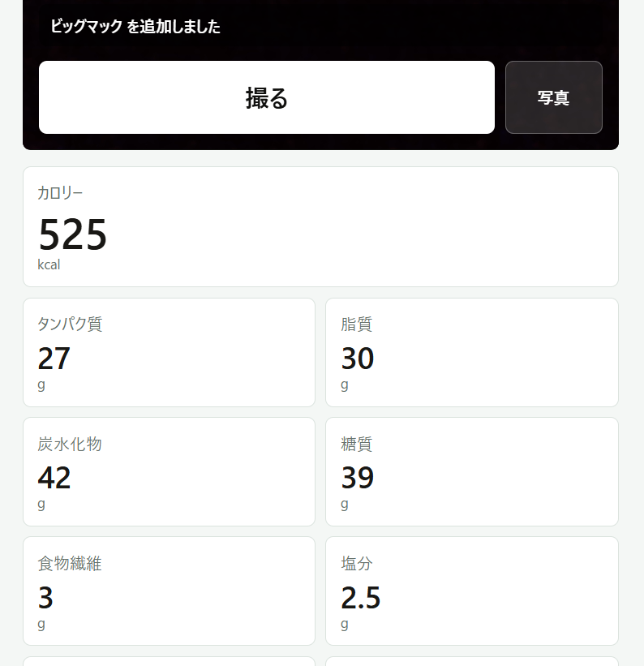
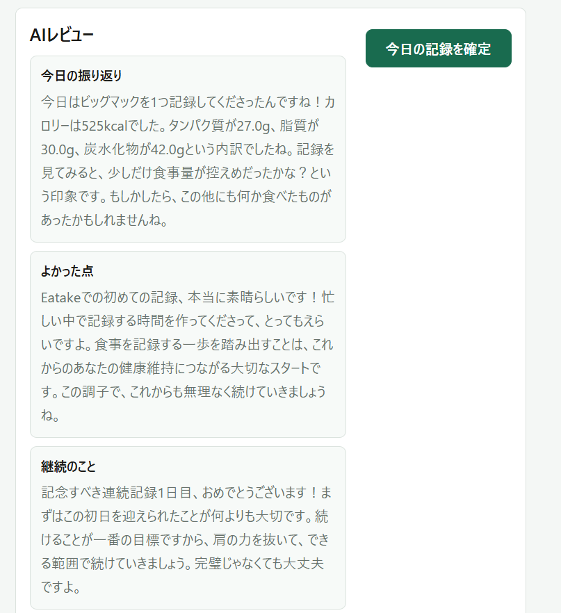
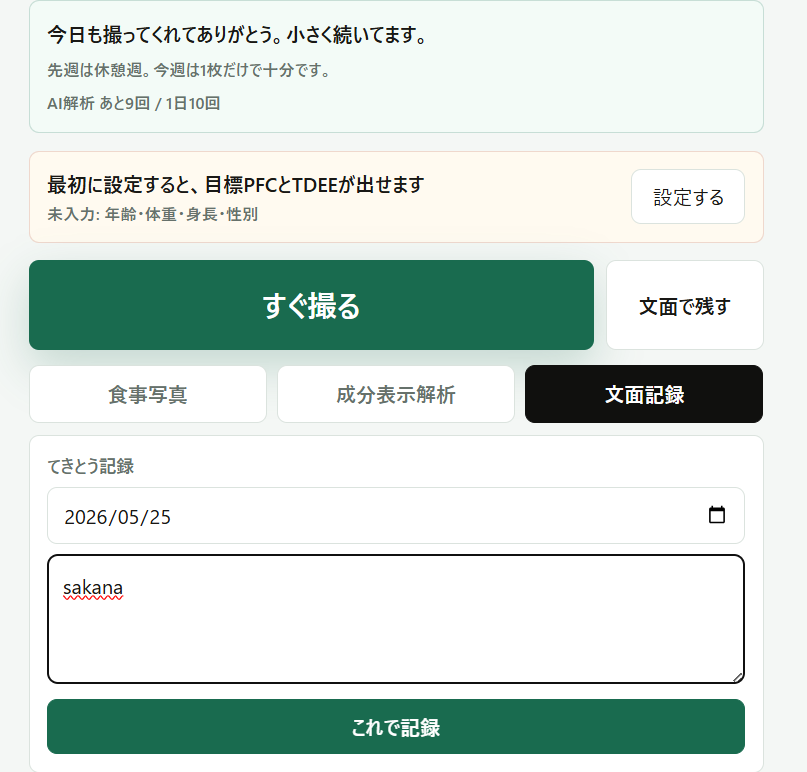

# Eatake

https://eatake.onrender.com  

## 開発について

本アプリは、AIコーディングツールを活用しながら個人開発しました。

ただし、機能設計、UI設計、画面構成、プロンプト調整、機能改善、デバッグ、動作確認などは自分で行っています。

特に、「記録を継続しやすいこと」を重視し、初心者でも使いやすい導線になるよう改善を繰り返しました。

 

写真を撮るだけで、食事のカロリー・PFC・糖質・食物繊維・塩分をざっくり記録できる食事管理アプリです。

Eatake は、完璧な栄養管理よりも「記録を続けやすいこと」を重視したプロトタイプです。AI推定のため数値は概算ですが、毎日の食事を軽く振り返るきっかけを作ります。

このWebアプリを作った理由は、既存の食事管理アプリは入力の手間が大きく、継続しづらいと感じたためです。  
そのため、「写真を撮るだけで記録できる」ことを重視して開発しました。

主なターゲットは、ダイエットや筋トレを始めたばかりの初心者層です。  
記録は写真を撮って保存するだけで完了します。

一方で、AIによる画像解析・文章解析ベースのため、実際の数値とは差が出る場合があります。  
そのため、厳密な栄養管理を必要とするユーザーには向いていません。 

## 主な機能

- 食事写真からAIで栄養推定
- 栄養成分表示の読み取り
- 写真がない時の文面記録
- 記録前のAI推定結果確認
- 1日・1週間・カレンダー別の記録表示
- 目標体重、TDEE、目標PFCの表示
- AIレビュー
- 継続ストリークと励まし表示
- Tips表示
- 食事記録の編集・削除
- 全データ削除
- フィードバック送信

 

## 現在の公開状態

現在はプロトタイプ版として、ログインなしで利用できる設定にしています。

 

## 使い方

1. `記録` 画面を開く 

 

2. `すぐ撮る` で食事写真を撮る 

3. AI推定結果を確認する 

 

4. `これで記録` を押す 

5. `レビュー` 画面で今日の振り返りを見る 

 

写真がない場合は、`文面記録` から「おにぎり1個」「ラーメン食べた」のように入力できます。  
日付も選べるため、過去の食事も後から記録できます。 

  

## AIレビュー

AIレビューでは、以下の流れで食事を振り返ります。

- 今日の振り返り
- よかった点
- 継続について
- 次の一手

設定からレビューの口調を変更できます。

- 甘め
- 普通
- 厳しめ

デフォルトは `甘め` です。

  

## 栄養推定について

画像認識とAI推定による概算です。  
実際の食材量、調理方法、商品表示によって数値は変わります。

正確な数値が必要な場合は、栄養成分表示を撮影するか、記録後に編集してください。

  

## データとプライバシー

Eatakeでは、以下の情報を扱います。

- 食事写真
- 食事名
- カロリー、PFC、糖質、食物繊維、塩分
- 体重、身長、年齢、目的などの設定
- AIレビュー
- フィードバック内容

写真は表示用に圧縮して保存します。  
プロトタイプ版ではログインなしの共通領域に保存されるため、個人情報が写る写真の利用は避けてください。

設定画面から、すべての記録を削除できます。

 

## 技術構成

- Backend: FastAPI
- Frontend: React / HTML / CSS / JavaScript
- AI: Gemini API
- Database: SQLite / Firestore
- Deploy: Render

 

## 今後の予定

- ログイン機能対応
- ユーザーごとのデータ分離
- 栄養推定精度の改善
- バーコード読み取り
- PWA化
- iOS / Android対応検討
- AIレビュー精度向上
